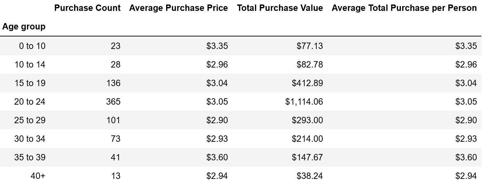
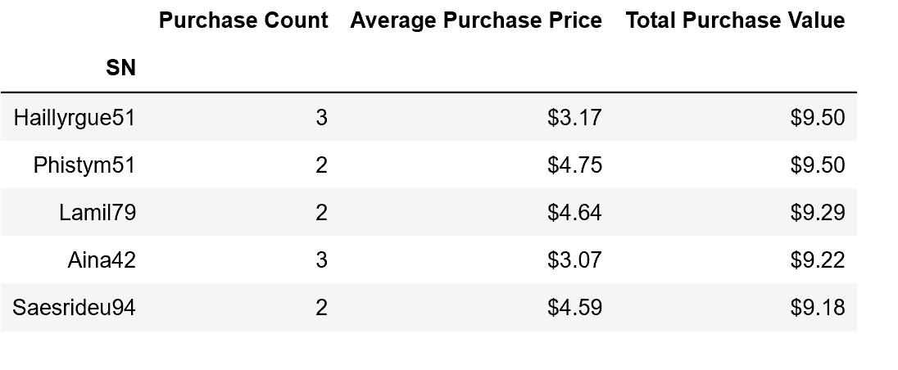
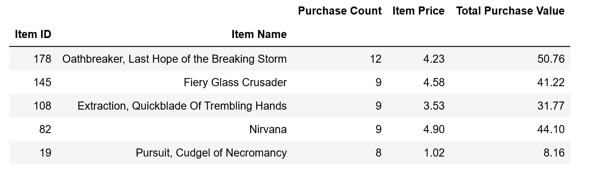

# pandas- video game analysis

## Observable Trends
* In the HeroesOfPymoli data, there were more male player than female players by 600%. 

* Among those players, players within age group of 20 to 24 spent the most ($1114) by purchasing
365 games, followed by age group of 15 to 19 purchasing 136 games and age group of 25 to 29 who purchased 101 games. 

* The other trend that we can look at is the top spenders. The players in this group bought 5 games and spent almost $19 on the games. 
* Among the games purchased, the most popular items were Oathbreaker followed by Fiery glass crusader, Nirvana and Extraction.

